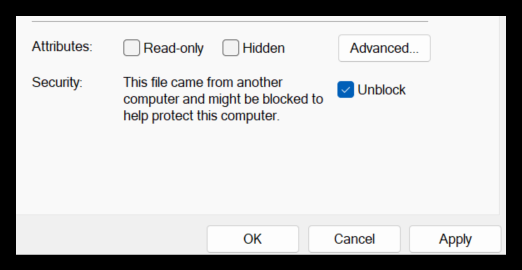

# ollama-setup
Repo to list steps for setting up ollama on windows machine

References:
* Ollama Offical GitHub page - [https://github.com/ollama/ollama](https://github.com/ollama/ollama)
* Ollama Tutorial: Running LLMs Locally Made Super Simple - [https://www.kdnuggets.com/ollama-tutorial-running-llms-locally-made-super-simple](https://www.kdnuggets.com/ollama-tutorial-running-llms-locally-made-super-simple)

Pre-requisitie or important points to understand:
* To check-in the new changes to code repo, your IDE must be linked to github account > like Visual Code git must be signed-in or uses Personal Access Token to commit changes. 
* Check various model available and relative RAM needed on your machine - [https://github.com/ollama/ollama?tab=readme-ov-file#model-library](https://github.com/ollama/ollama?tab=readme-ov-file#model-library)
> [NOTE] - You should have at least 8 GB of RAM available to run the 7B models, 16 GB to run the 13B models and 32 GB to run the 33B models.


Step 1: Download Ollama to Get Started
> * Access [https://ollama.com/download/OllamaSetup.exe](https://ollama.com/download/OllamaSetup.exe) (version 0.3.12 as in Oct,2024 & it's 663MB) from [https://ollama.com/download](https://ollama.com/download)
* Mark it unblock from exe file's properties 
* Double click to get it installed at dafult location as below. Check that installer's title bar shows ollama version as 0.3.12


* Get familiar with more cli commands which are listed here - [Ollama CLI Reference](https://github.com/ollama/ollama/blob/main/README.md#cli-reference)

* Test the setup with first command as below. 
```
C:\Users\singh>ollama list
NAME    ID    SIZE    MODIFIED
```

* Let's download/run first 2 models > llama3.2 (default will be of 3B with size 2 GB) and codellama (7B with size 3.8 GB)
```
C:\work.0\ollama-setup>ollama run llama3.2
pulling manifest
pulling dde5aa3fc5ff...   7% ▕██████████                                                                                                                                        ▏ 142 MB/2.0 GB  5.6 MB/s   5m38s
```


<h3>Other articles to Read</h3>
* Local Code AI Assistant setup [https://ollama.com/blog/continue-code-assistant](https://ollama.com/blog/continue-code-assistant) 