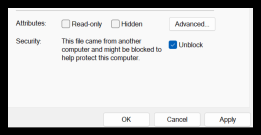
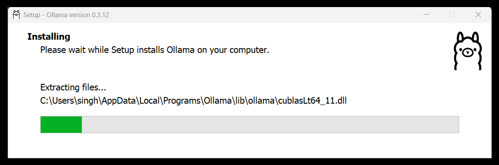

# ollama-setup
Repo to list steps for setting up ollama on windows machine

References:
* Ollama Offical GitHub page - [https://github.com/ollama/ollama](https://github.com/ollama/ollama)
* Ollama Tutorial: Running LLMs Locally Made Super Simple - [https://www.kdnuggets.com/ollama-tutorial-running-llms-locally-made-super-simple](https://www.kdnuggets.com/ollama-tutorial-running-llms-locally-made-super-simple)
* 10 points for running-models-with-ollama-step-by-step [running-models-with-ollama-step-by-step](https://medium.com/@gabrielrodewald/running-models-with-ollama-step-by-step-60b6f6125807#:~:text=1.%20What%20is%20Ollama?%20Ollama%20is%20an%20open-souce%20code,%20ready-to-use)
* Custom-llm-models-with-ollama-modelfile [https://www.gpu-mart.com/blog/custom-llm-models-with-ollama-modelfile](https://www.gpu-mart.com/blog/custom-llm-models-with-ollama-modelfile)
* How to run Ollama on Windows [https://medium.com/@researchgraph/how-to-run-ollama-on-windows-8a1622525ada#:~:text=What%20to%20Expect.%20This%20article%20will%20guide%20you%20through%20the](https://medium.com/@researchgraph/how-to-run-ollama-on-windows-8a1622525ada#:~:text=What%20to%20Expect.%20This%20article%20will%20guide%20you%20through%20the)

Pre-requisitie or important points to understand:
* To check-in the new changes to code repo, your IDE must be linked to github account > like Visual Code git must be signed-in or uses Personal Access Token to commit changes. 
* Check various model available and relative RAM needed on your machine - [https://github.com/ollama/ollama?tab=readme-ov-file#model-library](https://github.com/ollama/ollama?tab=readme-ov-file#model-library)
> [NOTE] - You should have at least 8 GB of RAM available to run the 7B models, 16 GB to run the 13B models and 32 GB to run the 33B models.
* Check individual model page for more details before using. Like here is page for Gemma2 model which has 3 variants - 2B, 9B (default) and 27B
More details at - [https://ollama.com/library/gemma2:2b](https://ollama.com/library/gemma2:2b)

Step 1: Download Ollama to Get Started
> * Access [https://ollama.com/download/OllamaSetup.exe](https://ollama.com/download/OllamaSetup.exe) (version 0.3.12 as in Oct,2024 & it's 663MB) from [https://ollama.com/download](https://ollama.com/download)
* Mark it unblock from exe file's properties 
* Double click to get it installed at dafult location as below. Check that installer's title bar shows ollama version as 0.3.12


* Customize the installation to a specific directory as 
> $ .\OllamaSetup.exe /DIR=D:\MYDIRECTORY

* Get familiar with more cli commands which are listed here - [Ollama CLI Reference](https://github.com/ollama/ollama/blob/main/README.md#cli-reference)

* Test the setup with first command as below. 
```
C:\Users\singh>ollama list
NAME    ID    SIZE    MODIFIED
```
Step 2: Get the Models
> Next, you can visit the model library to check the list of all model families currently supported. The default model downloaded is the one with the latest tag. On the page for each model, you can get more info such as the size and quantization used.
* Let's download (pull command) / run (run command)  first 2 models 
> First model is llama3.2 (default will be of 3B with size 2 GB) 
```
C:\work.0\ollama-setup>ollama run llama3.2
pulling manifest
pulling dde5aa3fc5ff... 100% ▕██████████████████████████████████████████████████████████████████████████████████████████████████████████████████████████████████████████████████▏ 2.0 GB
pulling 966de95ca8a6... 100% ▕██████████████████████████████████████████████████████████████████████████████████████████████████████████████████████████████████████████████████▏ 1.4 KB
pulling fcc5a6bec9da... 100% ▕██████████████████████████████████████████████████████████████████████████████████████████████████████████████████████████████████████████████████▏ 7.7 KB
pulling a70ff7e570d9... 100% ▕██████████████████████████████████████████████████████████████████████████████████████████████████████████████████████████████████████████████████▏ 6.0 KB
pulling 56bb8bd477a5... 100% ▕██████████████████████████████████████████████████████████████████████████████████████████████████████████████████████████████████████████████████▏   96 B
pulling 34bb5ab01051... 100% ▕██████████████████████████████████████████████████████████████████████████████████████████████████████████████████████████████████████████████████▏  561 B
verifying sha256 digest
writing manifest
success
>>> how are you?
I'm just a language model, so I don't have feelings or emotions like humans do. However, I'm functioning properly and ready to assist you with any questions or tasks you may have! How can I help you today?

>>> exit
It was nice chatting with you even if it was brief. If you need anything in the future, feel free to come back and ask. Have a great day!

>>> bye
Bye!

>>>
Use Ctrl + d or /bye to exit.
>>> /bye

C:\work.0\ollama-setup>
```

> 2nd model is Codellama (7B with size 3.8 GB)
```
C:\work.0\ollama-setup>ollama run codellama
pulling manifest
pulling 3a43f93b78ec... 100% ▕██████████████████████████████████████████████████████████████████████████████████████████████████████████████████████████████████████████████████▏ 3.8 GB
pulling 8c17c2ebb0ea... 100% ▕██████████████████████████████████████████████████████████████████████████████████████████████████████████████████████████████████████████████████▏ 7.0 KB
pulling 590d74a5569b... 100% ▕██████████████████████████████████████████████████████████████████████████████████████████████████████████████████████████████████████████████████▏ 4.8 KB
pulling 2e0493f67d0c... 100% ▕██████████████████████████████████████████████████████████████████████████████████████████████████████████████████████████████████████████████████▏   59 B
pulling 7f6a57943a88... 100% ▕██████████████████████████████████████████████████████████████████████████████████████████████████████████████████████████████████████████████████▏  120 B
pulling 316526ac7323... 100% ▕██████████████████████████████████████████████████████████████████████████████████████████████████████████████████████████████████████████████████▏  529 B
verifying sha256 digest
writing manifest
success
>>> list a basic java file with output as hello ollama
public class HelloOllama {
    public static void main(String[] args) {
        System.out.println("Hello Ollama!");
    }
}
This Java program prints "Hello Ollama!" to the console when run. The `System.out.println()` statement is used to print a message to the console, and the string literal "Hello Ollama!" is passed as an
argument to this method.

>>> /bye

C:\work.0\ollama-setup>
```
* Local setup folder location > You can see more details on downloaded models,versions and their manifests at C:\Users\<username>\\.ollama\models\manifests\registry.ollama.ai\library

Here are more commands to interact:

```
C:\work.0\ollama-setup>ollama ps
NAME                ID              SIZE      PROCESSOR    UNTIL
codellama:latest    8fdf8f752f6e    9.0 GB    100% CPU     2 minutes from now

C:\work.0\ollama-setup>ollama list
NAME                ID              SIZE      MODIFIED
codellama:latest    8fdf8f752f6e    3.8 GB    4 minutes ago
llama3.2:latest     a80c4f17acd5    2.0 GB    23 minutes ago

C:\work.0\ollama-setup>ollama show llama3.2
  Model
    architecture        llama
    parameters          3.2B
    context length      131072
    embedding length    3072
    quantization        Q4_K_M

  Parameters
    stop    "<|start_header_id|>"
    stop    "<|end_header_id|>"
    stop    "<|eot_id|>"

  License
    LLAMA 3.2 COMMUNITY LICENSE AGREEMENT
    Llama 3.2 Version Release Date: September 25, 2024


C:\work.0\ollama-setup>ollama show codellama
  Model
    architecture        llama
    parameters          6.7B
    context length      16384
    embedding length    4096
    quantization        Q4_0

  Parameters
    rope_frequency_base    1e+06
    stop                   "[INST]"
    stop                   "[/INST]"
    stop                   "<<SYS>>"
    stop                   "<</SYS>>"

  License
    LLAMA 2 COMMUNITY LICENSE AGREEMENT
    Llama 2 Version Release Date: July 18, 2023


C:\work.0\ollama-setup>
```
Step 3: Manual download a model and configure to run

* Refer This article : [https://medium.com/@gabrielrodewald/running-models-with-ollama-step-by-step-60b6f6125807](https://medium.com/@gabrielrodewald/running-models-with-ollama-step-by-step-60b6f6125807) > section 7. Integrating models from other sources

* Download a model file *.gguf
* Create a modelfile with customization params for model like temprature and sys/user prompt

Step 4: Customize the Models


** Integrate with different frameworks
> Ollama running in background is accessible as any regular REST API. Therefore it is easy to integrate it withing an application using libraries like requests, or a bit more developed frameworks like FastAPI, Flask or Django.

Step 5: Run Ollama with Python

Easy pip install for Ollama python package from ➡️ https://pypi.org/project/ollama/0.1.3:
```
//install via pip
pip install ollama

//Generating embedding directly from Python code
import ollama
embedding = ollama.embeddings(model="llama2:7b", prompt="Hello Ollama!")

//hit via CURL to get api-response 
curl http://localhost:11434/api/embeddings -d '{
  "model": "llama2:7b",
  "prompt": "Here is an article about llamas..."
}'

//hit as chat interface
curl http://localhost:11434/api/chat -d '{
  "model": "llama3.2",
  "messages": [
    { "role": "user", "content": "why is the sky blue?" }
  ]
}'
```

Step 6: Run Ollama with LangChain

> Ollama has been seamlessly integrated into the Langchain framework, streamlining our coding efforts and making our work on the technical side even more straightforward:

➡️ https://python.langchain.com/docs/integrations/llms/ollama

```
# pip install langchain_community
from langchain_community.embeddings import OllamaEmbeddings

embed = OllamaEmbeddings(model="llama2:7b")
embedding = embed.embed_query("Hello Ollama!")
```

Step 7: run Ollama with Springboot


<h3>Other articles to Read</h3>

* Local Code AI Assistant setup [https://ollama.com/blog/continue-code-assistant](https://ollama.com/blog/continue-code-assistant)

* you can move them anywhere you like, via the OLLAMA_MODELS environment variable.
Docs: https://github.com/ollama/ollama/blob/main/docs/faq.md#where-are-models-stored
